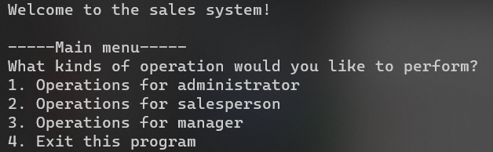

# CSCI3170 Sales System  

  

[](https://github.com/RichardLitt/standard-readme)

This is a simple sales system for a computer part store to manage the employees, transactions, and inventories. 

The system is implemented in Java and SQL. In order to implement the system, you need to have access to CUHK CSE Server or other servers that support Java and SQL. It contains database ER diagrams, Database schema, and Java source code. 

## Table of Contents
- [Install](https://github.com/Gavin-OP/csci3170_group_project_sales_system/blob/main/README.md#install)
- [Usage](https://github.com/Gavin-OP/csci3170_group_project_sales_system/blob/main/README.md#usage)
- [Contributing](https://github.com/Gavin-OP/csci3170_group_project_sales_system/blob/main/README.md#contributing)
- [License](https://github.com/Gavin-OP/csci3170_group_project_sales_system/blob/main/README.md#license)

## Install  

1. Get access to CUHK CSE Server or other servers that support Java and SQL.
2. Clone the repository to your server by using the following command:
    ```bash
    git clone https://github.com/Gavin-OP/csci3170_group_project_sales_system.git
    ```
3. Go to the repository folder by using the following command:
    ```bash
    cd csci3170_group_project_sales_system/phase2_code_implementation
    ```

## Usage

1. Remove existing class files by using the following command:
    ```bash
    rm -rf *.class
    ```
2. Compile the Java files by using the following command:
    ```bash
    javac Main.java
    ```
3. Run the program by using the following command:
    ```bash
    java -classpath ./mysql-jdbc.jar:./ Main
    ```
4. Follow the instructions on the screen to use the system.
   - For the sample source data folder, please refer to the folder `sample_data`.
   - In the `sample_data`, there are 5 files:
     - `category.txt`  
     - `manufacturer.txt`  
     - `part.txt`  
     - `salesperson.txt`  
     - `transaction.txt`  

## Contributing
PRs and [issues](https://github.com/Gavin-OP/csci3170_group_project_sales_system/issues) gladly accepted!

## License

[UNLICENSE](./LICENSE)

